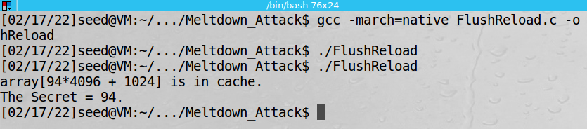
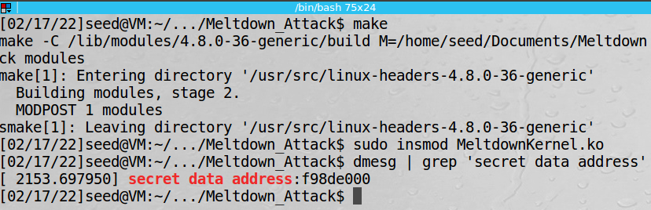
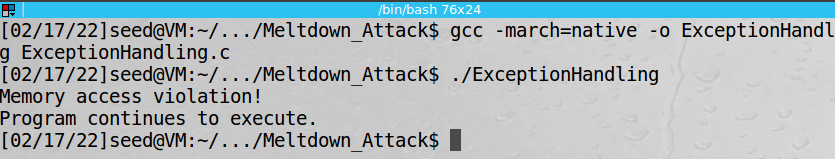
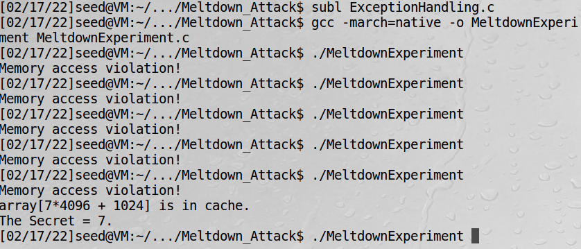
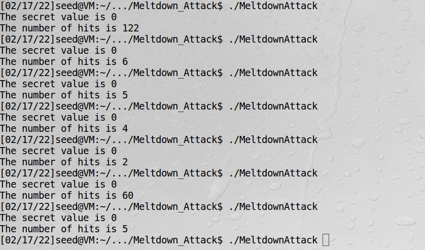
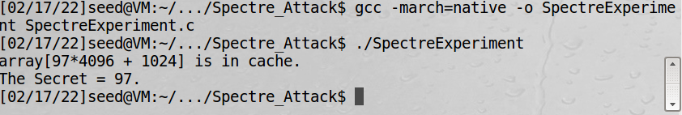
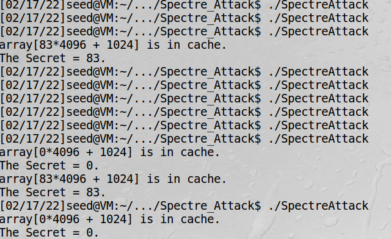

# Meltdown-Spectre-analysis

## Getting started

After reading the papers of Meltdown[^1] and Spectre[^2] I tried to solve the laboratory tasks provided by SEED Labs[^3][^4] to get a better understanding of how the initial variants of these attacks work. 

#

## SEED Labs - Meltdown
<details>
To solve this lab whose final purpose is to reproduce the Meltdown attack, I used an Ubuntu 16.04 VM[^5]. The VM was running on top of an Intel i5 10th generation CPU. 

#
### Task 1: Reading from Cache versus from Memory

After compiling and executing the "CacheTime" script provided in the lab, one can observe that reading from the cache is significantly faster than reading from the memory. 


In this case, array[3\*4096] and array[7\*4096] are cache hits.

#

### Task 2: Using Cache as a Side Channel

In this task, one is supposed to use the Flush + Reload method to leak a one-byte secret. The method consists of flushing all the possible values of the secret from the cache, then invoking the victim function which will cache the secret, and finally reloading all the possible values. By measuring the reading time, one can discover the secret.



#

### Task 3 & 4: Place Secret Data in Kernel Space & try to access it

This tasks ask to compile and load a kernel module that loads a secret in the kernel space. It also provides a window for a user-space program to cache the secret.

To get the attack working, one would need to know the address of the secret inside the kernel space. In this case, the command 'dmesg' would do the job, but in practice, the attacker would need to find a way of guessing that address.

Trying to access the secret directly from the user-space would result in an error.





#

### Task 5: Handle Error/Exceptions in C

This task shows how to handle exceptions in C using ```sigsetjmp()``` and ```siglongjmp()```. After executing the code provided that tries to access the kernel secret, the execution should no longer end with an error.



#

### Task 6: Out-of-Order Execution by CPU

This task shows that instructions executed out of order can influence the state of the cache. After running the code enough times, one could get a cache hit on 7. This means that the line after the one that raises the exception actually gets executed.



#

### Task 7: The Basic Meltdown Attack

In this task, one should implement the meltdown attack and leak the secret loaded in the kernel previously.

However, when reproducing the attack I was not able to leak the secret. The most cache hits occured at byte 0.



This could indicate that the secret was not actually loaded at the specified address. But when I looked inside the address space of the kernel module, the secret was indeed placed at the specified address.

It turns out that the cause of the issue was actually the CPU of the machine.
The 10th generation of Intel i5 is not vulnerable to Meltdown anymore[^6].

<!-- To test this hypothesis I wanted to reproduce the experiment when booting directly from a live CD, insted of using a VM.  TBC -->

#

</details>

## SEED Labs - Spectre
<details>
In this lab I used the same setup as in the previous one.

### Tasks 1 and 2: Side Channel Attacks via CPU Caches

Those tasks are very similar to the ones in the previous lab.

### Task 3: Out-of-Order Execution and Branch Prediction

The purpose of this task is to show how training the branch predictor may lead to execution of code sections that were not meant to be executed. The experiment trains the branch predictor with numbers smaller than 10 and then feeds 97 to the trained if statement. In the end, the secret (97) can be restored from the cache.

The task suggests commenting the lines where ```size``` is flushed. In this case, ```size``` would be cached and accessed faster, which means the speculative execution will not be launched when calling ```victim(97)```.

The task also suggests replacing the function call ```victim(i)``` with ```victim(i + 20)```. In this case, the branch prediction would be trained to go on the false-branch, which is the opposite of the intended behavior.



### Task 4: The Spectre Attack

In this task, one is supposed to steal a secret from a sandboxed area which is guarded by an if statement using the technique from the previous task.

Because of the noise, the program might have to be run multiple times. In some cases, it also returns the value 0 together with the actual secret. This happens because 0 would be loaded in the cache during the regular execution, as the returned value of ```restrictedAccess()```.



### Task 5: Improve the Attack Accuracy

This task suggests improving the accuracy by repeating the experiment multiple times and keeping a score for each potential result. In the end, the byte with the highest score will be the answer. Note that 0 should be excluded, as it will always be a cache hit for the reason mentioned in the previous task.

### Task 6: Steal the Entire Secret String

The code for stealing the whole secret can be found in ```SpectreFinal.c```.


</details>

## Resources

[^1]: [Meltdown paper](https://meltdownattack.com/meltdown.pdf)
[^2]: [Spectre paper](https://spectreattack.com/spectre.pdf)
[^3]: [Meltdown lab](https://seedsecuritylabs.org/Labs_16.04/System/Meltdown_Attack)
[^4]: [Spectre lab](https://seedsecuritylabs.org/Labs_16.04/System/Spectre_Attack)
[^5]: [vulnerable VM used](https://seed.nyc3.cdn.digitaloceanspaces.com/SEEDUbuntu-16.04-32bit.zip)
[^6]: [Ice Lake and Meltdown](https://www.digitaltrends.com/computing/intel-ice-lake-wont-rid-spectre/)