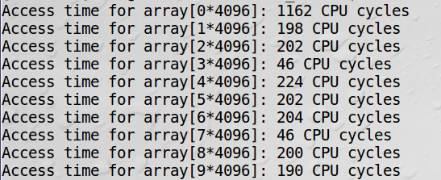

# Meltdown-Spectre-analysis

## Getting started

After reading the papers of Meltdown[^1] and Spectre[^2] I tried to solve the laboratory tasks provided by SEED Labs[^3][^4] to get a better understanding of how the initial variants of these attacks work. 

#

## SEED Labs - Meltdown
<!-- 
 -->
To solve this lab which final purpose is to reproduce the Meltdown attack, I used an Ubuntu 16.04 VM[^5]. The VM was running on top of an Intel i5 10th generation CPU. 

#
### Task 1: Reading from Cache versus from Memory

After compiling and executing the "CacheTime" script provided in the lab, one can observe that reading from the cache is significantly faster than reading from the memory. 

In this case, array[3\*4096] and array[7\*4096] are cache hits.

#

### Task 2: Using Cache as a Side Channel

#

### Task 3 & 4: Place Secret Data in Kernel Space & try to access it

#

### Task 5: Handle Error/Exceptions in C

#

### Task 6: Out-of-Order Execution by CPU

#

### Task 7: The Basic Meltdown Attack

#

<!-- 
 -->

## Resources

[^1]: [Meltdown paper](https://meltdownattack.com/meltdown.pdf)
[^2]: [Spectre paper](https://spectreattack.com/spectre.pdf)
[^3]: [Meltdown lab](https://seedsecuritylabs.org/Labs_16.04/System/Meltdown_Attack)
[^4]: [Spectre lab](https://seedsecuritylabs.org/Labs_16.04/System/Spectre_Attack)
[^5]: [vulnerable VM used](https://seed.nyc3.cdn.digitaloceanspaces.com/SEEDUbuntu-16.04-32bit.zip)